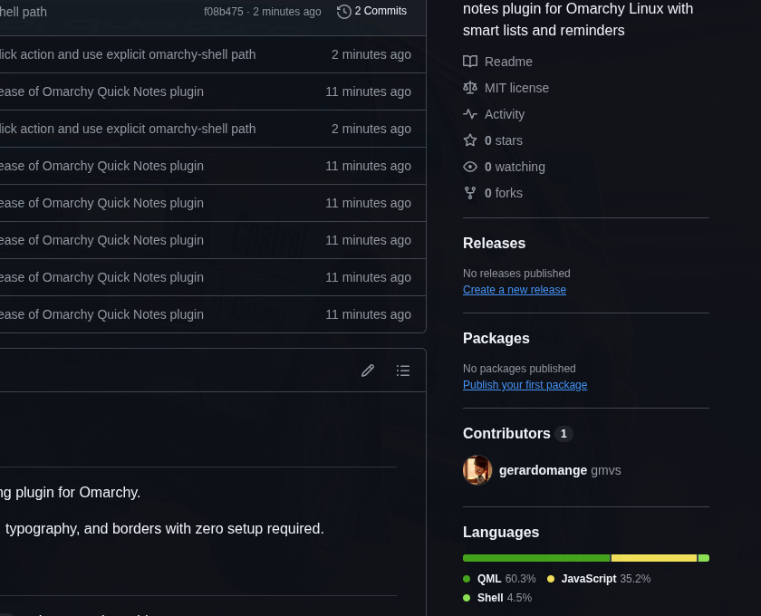

# Quick Notes for Omarchy

A fast, lightweight, keyboard-first scratchpad and note-taking plugin for [Omarchy Linux](https://omarchy.org/).

Summoned instantly anywhere with a keybinding or from your top bar, it provides an auto-saving modal overlay with smart Markdown lists, automatic numbered sequences, interactive task checklists, and native Omarchy reminders.



## Surfaces

Quick Notes integrates directly into the `omarchy-shell` Quickshell process and exposes two surfaces:

- **Overlay**: A centered modal scratchpad window on the Wayland layer-shell overlay with instant keyboard focus, scrim backdrop, and format toolbar.
- **Bar Widget**: An icon button (`󰠮`) on the Omarchy status bar to summon or toggle the scratchpad with one click.

Both surfaces share the same persistent state and follow active Omarchy theme colors, fonts, and corner radius tokens automatically.

## Features

- **Instant Summon**: Open immediately with `Super + N` or by clicking the bar widget.
- **Smart Bullet Lists**: Type `- ` or `* ` to begin a bullet list. Pressing `Enter` automatically carries the bullet to the next line.
- **Auto-Incrementing Numbered Lists**: Type `1. ` or `1) ` and subsequent lines automatically increment (`2. `, `3. `, etc.).
- **Interactive Task Checklists**: Type `[ ] ` or `- [ ] ` to start a checklist. Press `Ctrl + D` or `Ctrl + Enter` anywhere on the line to toggle `[ ]` ↔ `[x]`.
- **Clean List Exit**: Press `Enter` on an empty bullet or number to exit list mode seamlessly without manual backspacing.
- **Indentation Controls**: Use `Tab` to indent (2 spaces) and `Shift + Tab` to outdent list hierarchy.
- **Omarchy Reminder Integration**: Type a time and text (e.g., `15m Check the oven` or `30 Call dentist`) and press `Ctrl + R` (or click **Remind**) to schedule a native desktop reminder timer via `omarchy reminder`.
- **Zero-Loss Auto-Save**: Changes are automatically written to disk with debounced I/O and flushed immediately on close.
- **One-Click Clipboard**: Copy all notes with `Ctrl + Shift + C` or the **Copy** button.
- **Live Counter**: Real-time counter displaying line count, word count, and task completion progress.

## Installation

Install directly with the Omarchy plugin manager:

```bash
omarchy plugin add https://github.com/gerardomange/omarchy-quick-notes.git --enable
```

This clones the repository into `~/.config/omarchy/plugins/gmvs.quick-notes/`, validates the manifest, enables the overlay, and registers the bar widget.

### Updating

To update to the latest release:

```bash
omarchy plugin update gmvs.quick-notes
```

## Removal

To uninstall the plugin:

```bash
omarchy plugin remove gmvs.quick-notes
```

This removes the plugin directory from `~/.config/omarchy/plugins/gmvs.quick-notes/` and cleans up its entry in `~/.config/omarchy/shell.json`.

> [!NOTE]
> The uninstall process safely preserves your personal note content at `~/.local/state/omarchy/quick-notes.md` and any manual keybinding you added to `~/.config/hypr/bindings.lua`. Delete them manually if you no longer need them.

## Keybinding Setup

To summon Quick Notes with `Super + N`, add this binding to `~/.config/hypr/bindings.lua`:

```lua
o.bind("SUPER + N", "Quick Notes", "omarchy-shell shell toggle gmvs.quick-notes")
```

Then reload Hyprland:

```bash
hyprctl reload
```

## Shortcuts Reference

| Shortcut | Action |
|---|---|
| `Super + N` | Summon / dismiss Quick Notes overlay |
| `Esc` | Close overlay (auto-saved) |
| `Enter` | Create next bullet / number / checklist item |
| `Shift + Enter` | Insert newline without list continuation |
| `Tab` | Indent current line (2 spaces) |
| `Shift + Tab` | Outdent current line |
| `Ctrl + D` | Toggle task completion (`[ ]` ↔ `[x]`) |
| `Ctrl + R` | Trigger reminder from current line |
| `Ctrl + Shift + C` | Copy all notes to system clipboard |
| `Ctrl + S` | Force immediate disk save |

## Terminal CLI Usage

Quick Notes also provides a terminal CLI utility:

```bash
notes                    # Toggle overlay
notes open               # Open overlay
notes close              # Close overlay
notes cat                # Print notes to stdout
notes add "Buy milk"     # Append a new note from terminal
notes edit               # Edit notes file with $EDITOR
```

## Permissions and Security

- **Sandboxing & Scope**: Quick Notes is pure QML and JavaScript running within your local user session via `omarchy-shell`.
- **Network Access**: None. The plugin operates 100% offline and makes zero network connections.
- **Disk Access**: Reads and writes exclusively to its own note file at `~/.local/state/omarchy/quick-notes.md`.
- **Privileges**: No root, `sudo`, or system-level permissions required.

## Requirements

- **Omarchy Linux**: Version 4 (Quattro) or newer
- **Quickshell**: 0.3.1+ (included by default with Omarchy)
- **External Dependencies**: None

## License

[MIT License](LICENSE) © 2026 Gerardo Mange
